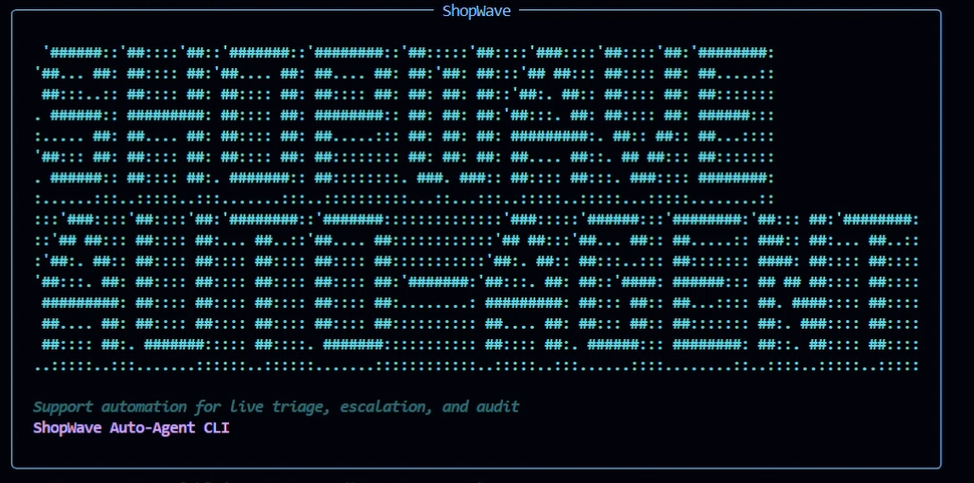
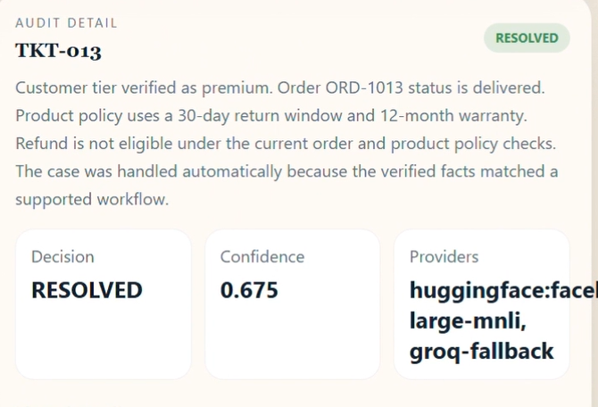
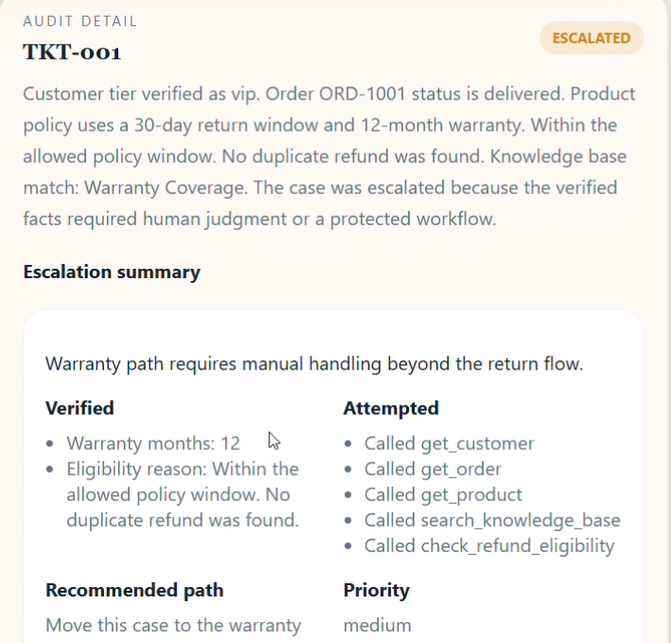

# ShopWave Auto-Agent

ShopWave Auto-Agent is a hackathon-ready autonomous support resolution system for the ShopWave e-commerce platform. It ingests 20 mock customer tickets, prioritizes them with `asyncio.PriorityQueue`, resolves eligible cases through a guarded ReAct-style workflow, escalates edge cases, and exports a full `audit_log.json`.



## What is in this repo

- `backend/`: FastAPI app, queue manager, agent loop, tool layer, live provider wrappers, analytics, and audit writer
- `frontend/`: React + Vite dashboard with search, analytics charts, worker lanes, audit panel, dark mode, and ticket JSON upload support
- `cli/run_agent.py`: run, inspect, and export the agent from the terminal with a rich colored banner
- `backend/data/`: ticket, customer, order, product, and knowledge-base fixtures
- `failure_modes.md`, `codeflow.md`, `agent.md`: future-maintenance docs

## Architecture summary

1. Tickets load into an `asyncio.PriorityQueue` with VIP-first priority.
2. A worker pool processes tickets concurrently.
3. Triage assigns one of six categories.
4. The custom ReAct loop gathers evidence with tools, enforces guards, and decides resolve vs escalate.
5. Audit data is exported to `audit_log.json` and streamed to the dashboard over SSE.

## Outcome alignment

The current fixture run matches the TRD expectation split:

- Resolved: `TKT-001`, `TKT-002`, `TKT-004`, `TKT-006`, `TKT-007`, `TKT-008`, `TKT-009`, `TKT-010`, `TKT-012`, `TKT-013`, `TKT-014`, `TKT-018`, `TKT-019`, `TKT-020`
- Escalated: `TKT-003`, `TKT-005`, `TKT-011`, `TKT-015`, `TKT-016`, `TKT-017`

## Local setup

### Backend + CLI

```bash
python -m venv .venv
.venv\Scripts\activate
pip install -r requirements.txt
python cli/run_agent.py run
```

### Frontend

```bash
cd frontend
npm install
npm run dev
```

### API

```bash
uvicorn backend.main:app --reload
```

The dashboard expects the API at `http://localhost:8000` by default.

## Docker

```bash
copy .env.example .env
docker compose up --build
```

## CLI commands

```bash
python cli/run_agent.py run
python cli/run_agent.py run --workers 3
python cli/run_agent.py status
python cli/run_agent.py audit
python cli/run_agent.py audit TKT-001
python cli/run_agent.py stats
python cli/run_agent.py export
```

### Frontend: resolved tickets



### Frontend: escalated tickets



## API endpoints

- `GET /health`
- `GET /tickets`
- `POST /tickets/upload` (upload a ticket JSON batch)
- `GET /audit`
- `GET /audit/{ticket_id}`
- `GET /analytics`
- `GET /stats`
- `GET /stream`
- `POST /run` with header `x-admin-token`

## Environment variables

| Variable | Purpose |
| --- | --- |
| `GROQ_API_KEY` | Live Groq reasoning provider |
| `GROQ_MODEL` | Groq chat model name |
| `GEMINI_API_KEY` | Live Gemini escalation-summary provider |
| `GEMINI_MODEL` | Gemini model name |
| `HUGGINGFACE_API_KEY` | Live Hugging Face zero-shot triage provider |
| `HUGGINGFACE_MODEL` | Hugging Face model name |
| `LLM_REQUEST_TIMEOUT` | Timeout for live provider requests |
| `OLLAMA_BASE_URL` | Optional local fallback base URL |
| `OLLAMA_MODEL` | Optional local fallback model name |
| `DATABASE_URL` | Optional Postgres target |
| `WORKER_COUNT` | Number of concurrent workers |
| `CONFIDENCE_THRESHOLD` | Escalation threshold, default `0.6` |
| `ESCALATION_AMOUNT_THRESHOLD` | Auto-escalate eligible high-value refund cases above `200` |
| `MAX_RETRIES` | Tool retry budget |
| `MAX_REACT_ITERATIONS` | Loop safety cap |
| `CHAOS_ENABLED` | Toggle synthetic tool chaos |
| `CHAOS_TIMEOUT_RATE` | Synthetic timeout rate |
| `CHAOS_MALFORMED_RATE` | Synthetic malformed response rate |
| `CHAOS_SERVER_ERROR_RATE` | Synthetic server error rate |
| `CHAOS_SEED` | Random seed for chaos |
| `ADMIN_TOKEN` | Required for `POST /run` |

## Verification done in this build

- Backend modules compile cleanly with `python -m py_compile`
- `python cli/run_agent.py run` completes successfully
- `audit_log.json` is generated from the full 20-ticket run
- Frontend dashboard supports the new theme toggle and ticket upload control
- CLI commands render the new colored ASCII banner consistently

## Notes

- The provider layer now attempts real Hugging Face, Groq, Gemini, and Ollama calls when configured, and falls back locally when those providers are unavailable.
- Optional Postgres writes are attempted only when an async Postgres driver is available.
